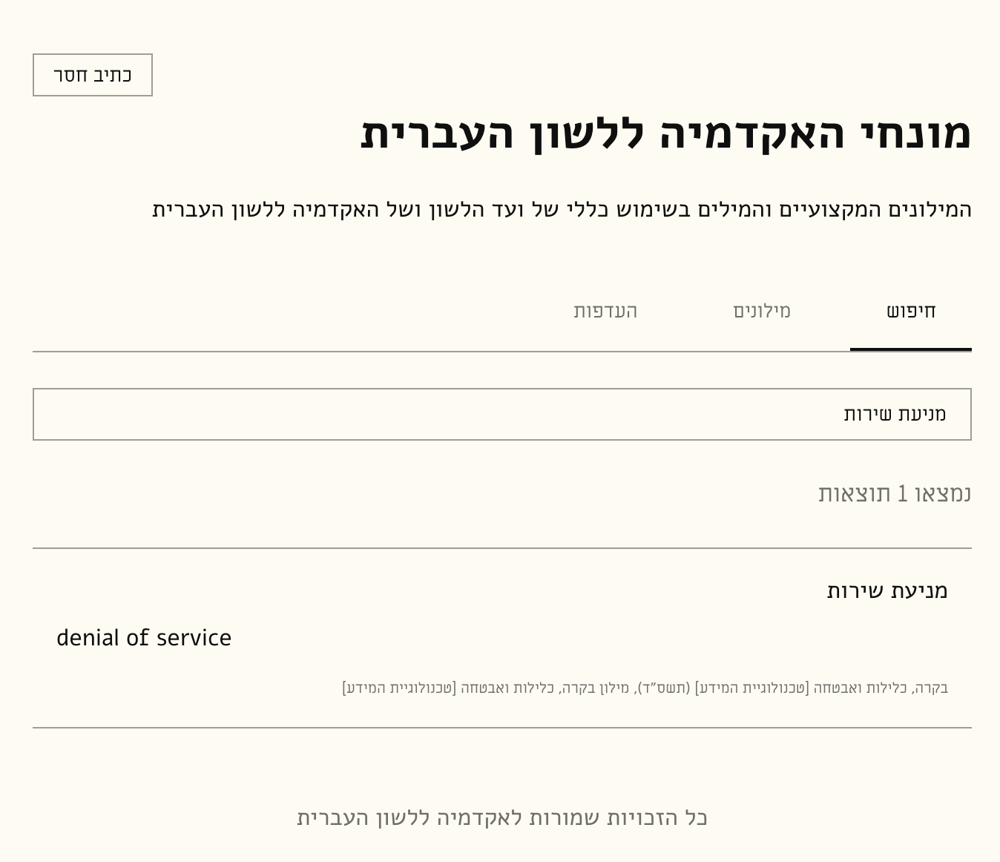

the original site (https://terms.hebrew-academy.org.il/) is currently [down](https://www.ynet.co.il/news/article/sjb04v0f11e) (as of April 2026), so i made this site so i can still use it, but the data is not included in the repo (due to copyright issues), but you can get it yourself from the Web Archive, and convert it to JSON using the provided script. 

# data setup

1. HTML: first have a folder with all the source HTML files from Web Archive. full list of urls: https://web.archive.org/web/20250627114638/https://terms.hebrew-academy.org.il/Millonim.aspx 
2. HTML TO JSON: run `html-to-json-converter.mjs` (it might need some modification to work) to convert the source HTML files to a single JSON file, that will be either:
    - located in `public/data.json`, OR
    - loaded as a local file (in the app settings)

# live site (without data)

https://adielbm.github.io/hebrew-academy-terms/

# dev

- `npm i` and `npm run dev` or `npm run build` etc..

# screenshot




# data.json sample

see also: public/schema.json

```json
[
  {
    "dictionary_name": "דודי קיטור (תש\"ב)",
    "dictionary_code": "100",
    "terms_count": 24,
    "terms": [
      {
        "id": "54671",
        "he": [
          {
            "terms": [
              {
                "haser": "צִנּוֹר הָאֵשׁ",
                "male": "צינור האש"
              }
            ]
          }
        ],
        "en": [
          {
            "term": "fire tube"
          },
          {
            "term": "smoke tube"
          }
        ],
        "subject": "מילון דודי קיטור"
      },
      {
        "id": "54672",
        "he": [
          {
            "terms": [
              {
                "haser": "אֹגֶן",
                "male": "אוגן"
              }
            ]
          }
        ],
        "en": [
          {
            "term": "flange"
          },
          {
            "term": "pipe flange"
          }
        ],
        "subject": "מילון דודי קיטור"
      },
      {
        "id": "54673",
        "he": [
          {
            "terms": [
              {
                "haser": "מַדָּף",
                "male": "מדף"
              }
            ]
          }
        ],
        "en": [
          {
            "term": "flap"
          },
          {
            "term": "flap valve"
          }
        ],
        "subject": "מילון דודי קיטור"
      },
      {
        "id": "54674",
        "he": [
          {
            "terms": [
              {
                "haser": "מוֹקֵד",
                "male": "מוקד"
              }
            ]
          }
        ],
        "en": [
          {
            "term": "grate"
          }
        ],
        "subject": "מילון דודי קיטור"
      }
    ]
  ...
  }
  ...
]
```